# Probability Topic Model: Model Comparison for Different Text Sizes 

This project aimed to introduce, explain, and use probabilistic topic models, a class of statistical models for text data analysis designed to identify and extract latent topic structures from text data. This article focused on the **LDA (Latent Dirichlet Allocation) model** in the probabilistic topic model, which is based on Bayesian statistical inference methods and uses the Dirichlet distribution to model the relationship between topics and documents. The main objective of the LDA model is to extract topics from textual data to enhance our comprehension of the content and to facilitate tasks like text classification.

The LDA model in the project was tested on three news dataset sizes: **title text, body text, and full content** to investigate the impact of text data size. The evaluation criteria for model quality were **classification efficiency** and **coherence score**.

All corresponding codes can be found in the [lda.py](https://github.com/atomxu10/NLP-ProbabilityTopicModel/blob/main/lda.py)

## Content
- [1. Introduction & Overview](#1)
- [2. Latent Dirichlet Allocation (LDA) Theory](#2)
  - [2.1 Bayesian Inference](#2-1)
  - [2.2 The Generative Process of LDA Model](#2-2)
  - [2.3 Parameters Fitting](#2-3)
  - [2.4 Assumption, Notation, and Algorithm](#2-4)
  - [2.5 Gibbs Sampling](#2-5)
- [3. Method](#3)
  - [3.1 Data](#3-1)
  - [3.2 Model Construction](#3-2)
    - [3.2.1 Pre-processing of Data](#3-2-1)
    - [3.2.2 Model Specification](#3-2-2)
    - [3.2.3 Label Topics](#3-2-3)
  - [3.3 Classification Analysis](#3-3)
    - [3.3.1 Topics Visualisation](#3-3-1)
    - [3.3.2 Prediction Accuracy](#3-3-2) 

## 1. Introduction & Overview

With the development of the internet, information is provided to people in various forms, such as texts, images, audio, and videos. However, as the information continues to grow, the necessity of developing an efficient tool to process, comprehend, and analyze this information becomes essential. Consequently, in the field of text information retrieval, extensive research is conducted in areas including text summarisation, text extraction, and dimensionality reduction. Researchers believe that if a substantial amount of textual data is converted into some low-dimensional subspaces through some tools, information covering this type of text data can be harvested, and then it can be "zoomed in or out" to access and explore the information we desire. Among them, the probabilistic topic model is one of the models with rapid development and mature application.

The probabilistic topic model is an unsupervised analytical tool to uncover hidden thematic structures from text and to establish probabilistic relationships between texts and topics. The LDA topic model is one of the most common and widely applied probabilistic topic models. It is characterized by its Bayesian foundation, which aids in revealing the distribution of topics in textual data, the relationships between topics, and the connections between topics and vocabulary. Practical applications of probabilistic topic models included text classification, information retrieval, content analysis, and content modeling, among other fields. By unearthing the underlying themes within textual data, the model could offer a deeper comprehension and analysis of textual content.

This project attempted to investigate the use of the LDA model and evaluate its quality. Particularly, it intends to answer three questions:

**Q1: Does the size of the text have an impact on the recognition and classification of the model when using the LDA topic model as a classifier?**

**Q2: How can hyper-parameters be utilized to improve model efficiency?**

**Q3: How does the size of the text data affect the interpretability of the LDA model?**

In **Chapter 2**, the principles and different parameters of the model will be introduced. Gibbs sampling, which is an inference method applied to the LDA model for processing and operating on text data, will also be introduced.

**Chapter 3** is divided into two main sections. The first section is dedicated to the exposition of the dataset and the process of constructing the model. Within this section, a comprehensive account of the data preprocessing procedures is provided. Detailed specifications of the model, as well as the methodology employed by labeling the topics to the model in preparation for subsequent categorization analysis are elucidated. The second section contains an introduction to the enhancement of model performance, as well as a description of the methods and criteria employed for evaluating model performance.

In **Chapter 4**, the results are obtained, and the impact of varying text sizes on the classification of the LDA topic model is discussed. Additionally, an analysis of model performance enhancement through hyper-parameter optimization is conducted.

In **Chapter 5**, the results of this analysis are discussed, and some directions for further study are provided.

## 2. Latent Dirichlet Allocation (LDA) Theory

### 2.1 Bayesian Inference
Bayesian inference is a method for calculating the probability of an event based on prior knowledge (prior beliefs or assumptions) and new evidence (outcomes of related events). It allows us to use new observational results to improve the model by iteratively updating the prior probability with more observational evidence, generating new posterior probabilities.

The form of Bayes theorem:

$$\pi(\theta \mid \mathbf{x}) = \frac{\pi(\theta) f(\mathbf{x} \mid \theta)}{f(\mathbf{x})}$$

- Prior
  
  $\pi(\theta)$ is known as the prior distribution of $\theta$, which represents the initial understanding of an event and the assessment of its probability distribution before observing any new data. This prior information can be based on previous data, domain expertise, or subjective evaluation.

- Likelihood
  
  $f(\mathbf{x} \mid \theta)$ is known as the likelihood function. It describes how data is generated given certain parameters and quantifies the probability of observing data under different parameter values.

- Posterior

  $\pi(\theta \mid \mathbf{x})$ is known as the posterior distribution of $\theta$. It is calculated by combining prior information and likelihood. It represents the updated belief about an event after considering new evidence.

The proportionality constant $f(\mathbf{x})$ is also known as the evidence. It normalizes the posterior distribution so it integrates to 1. Therefore, the form of Bayes theorem also can be represented as:

$$\pi(\theta \mid \mathbf{x}) \propto \pi(\theta) f(\mathbf{x} \mid \theta)$$

The posterior is proportional to the product of the likelihood and the prior.

### 2.2 The Generative Process of the LDA Model

The LDA model assumes that documents are composed of multiple topics, each topic consisting of a set of words. Each document is probabilistically assigned different topics, and each topic is probabilistically associated with different words. These topics are hidden in the model and cannot be directly observed. However, by introducing the Bayesian theorem, we can attempt to infer the possible topics in a document and their distributions by observing the words within the document. LDA model uses the Dirichlet distribution to model the distribution of topics and words. The Dirichlet distribution is a probability distribution that describes the distribution of a multinomial distribution. This hierarchical structure where documents are made up of topics, and topics are made up of words allows LDA to capture complex relationships between documents, topics, and words.

Specifically, before generating a new document, the document’s topic distribution needs to be determined, which defines the weight of each topic in the new document. The LDA model uses the Dirichlet distribution as a prior distribution for the topic distribution. The hyperparameter α controls the diversity and sparsity of the topic distribution. Once the topic distribution is determined, sampling can be done randomly from a pre-defined distribution or calculated based on prior information. After selecting a topic, specific words can be generated according to the word distribution of the selected topic. The word distribution is considered a multinomial distribution, and the process of selecting words is equivalent to sampling from a multinomial distribution. The number of times a word occurs in a document depends on how likely that word is to occur in a given topic.

    

Figure 2.1: The Generative process of LDA model 

For Document 1, the distribution of topics is characterized by 60% for Topic 1, 20% for Topic 2, and 20% for Topic 3. Similarly, for Document 2, the distribution of topics is 20% for Topic 1, 70% for Topic 2, and 10% for Topic 3. Within each topic, words follow a multinomial distribution, representing the probability distribution of words within the topic. In Topic 1, the probability of sampling "gender" is 11%, "harassment" is 5%, and "woman" is 3%.

### 2.3 Parameters Fitting
The parameters set by the user affect the learning process of the model and the final result. These parameters are not obtained through data training but are determined by some prior knowledge or experience. The value of the parameter usually needs to be adjusted and optimized according to the actual situation. The values of these parameters can impact the performance of the LDA model and the generated topic distributions. The following are some of the main parameters in the LDA model:

- Number of Topics (K)
  
  It defines the number of topics the user aims to extract from the data. Too few topics may lead to information loss, while too many topics could render the model difficult to interpret. Hence, choosing an appropriate number of topics is pivotal in determining the model’s quality.

- Parameter $\alpha$
  
  Parameter $\alpha$ is the Dirchlet-prior concentration parameter of the per-document topic distribution, determining the density of the topic distribution for each document. A smaller value of $\alpha$ leads to sparser topic distributions within documents, implying that each document tends to be associated with only a few topics. Conversely, a larger value of α results in more uniform topic distributions within documents, meaning that each document might encompass a broader range of topics. The appropriate value of $\alpha$ depends on the characteristics of the text data, usually between 0.01 and 1.

- Parameter $\beta$

  The parameter of the per-topic word distribution determines the density of the vocabulary distribution of each topic. A smaller value of $\beta$ results in sparser vocabulary distributions for topics, implying that each topic is likely to consist of a small number of words. A larger value of $\beta$ makes the vocabulary distribution of the topics more even. Similar to $\alpha$, the appropriate value of $\beta$ depends on the characteristics of the text, usually between 0.01 and 1.

- Number of Iterations

  LDA models are often trained using iterative algorithms like Gibbs sampling. Iterations refer to the number of times the algorithm performs sampling and updates parameters. A higher number of iterations means that the model requires more sampling and parameter updates, resulting in increased training time. A high number of iterations may lead to overfitting, while too few may cause the model to fail to adequately learn the topic structure. The suitable iteration counts to aid in the model converging to a stable state.

### 2.4 Assumption, Notation, and Algorithm
- N represents the total number of collection words in a document. A document is represented as $\mathbf{w}$ = { $\{w_1, w_2, \ldots, w_N\}$ }, where $w_n\$ is the nth word in sequence.

- A corpus is represented as $\mathbf{D}$ = { $\{\mathbf{w}_1, \mathbf{w}_2, \ldots, \mathbf{w}_M\}\$ }, $M\$ is the number of documents.

The LDA model assumes that the document is generated in the following way:

1. Determine the number of topics K required, and determine the document length N
2. Obtain the parameter θ from the Dirichlet distribution of the hyper-parameter $\alpha$.
3. For each word token $w_n\$ in the document
   
     (a) Sampling topic z from a multinomial distribution with $\theta$ as a parameter, $z_n \sim \text{Multinomial}(\theta)\$.

     (b) The word distribution is determined by sampling, which is jointly determined by topic z and hyperparameter $\beta$.

Given parameters $\alpha$ and $\beta$, the joint distribution of $\theta$, z, and w is given by:

$$p(\theta, z, w \mid \alpha, \beta) = p(\theta \mid \alpha) \prod_{n=1}^{N} p(z_n \mid \theta) p(w_n \mid z_n, \beta)$$

$p(\theta \mid \alpha)$ determines how likely it is to observe the topic distribution of $\theta$ conditional on $\alpha$, $p(z_n \mid \theta)$ is the probability of the individual topic assignment $z_n$ of word $n$ is conditional on the topic distribution of $\theta$. $p(w_n \mid z_n, \beta)$ is the probability of each word conditional on the topic assignment $z_n$ and the word probabilities of the given topics which are determined by $\beta$.

The likelihood of the document can be represented as:

$$\prod_{d=1}^{D} P(\theta_d \mid \alpha) \left( \prod_{n=1}^{N_d} \sum_{z_{d,n}} P(z_{d,n} \mid \theta_d) P(w_{d,n} \mid z_{d,n}, \varphi) \right)$$

The objective of the likelihood function is to maximize the probability that the model generates the observed data so that the model can better explain the observed text data. Due to its computational infeasibility, methods such as Gibbs sampling and variational inference are usually used in practical applications to maximize the likelihood function to estimate the parameters and hidden variables of the model.

    

Figure 2.2: Plate representation of LDA generative document process (inspired by Blei’s diagram (Blei et al., 2003)). 

  
In Figure 2.2, each variable is denoted by nodes, and arrows mark the generation process of nodes. The proportion parameter($\alpha$), topic proportions($\theta$), assignments(w), and topics($\beta$) are not shaded. The observed word (w) is shaded. The rectangles are “plate” notation, which represents replication. The N plate represents the collection words within documents; the M plate denotes the total number of documents within the collection.

### 2.5 Gibbs Sampling

The method of performing numerical computations through probabilistic simulations is collectively referred to as the Monte Carlo method, while the MCMC method is known as Markov Chain Monte Carlo (Carlo, 2004). MCMC is a specific type of Monte Carlo method, where the previous sample value is used to stochastically generate the next sample value, thereby creating a Markov chain. The purpose of MCMC algorithms is to construct a Markov chain with the target posterior distribution as its stationary distribution, facilitating subsequent sampling (Darling, 2011).

Gibbs sampling is an MCMC method for estimating the implicit structures of topic assignment to documents and words (Darling, 2011). Under the condition that direct sampling is difficult and the conditional distribution is known, a variable is updated from known variable values and Bayes’ theorem to make the conditional distribution converge. This process is repeated, and finally, a sample set that conforms to a multidimensional distribution is obtained. In the LDA model, Gibbs sampling iteratively samples the topic of each word from a conditional distribution and gradually converges to a stable state that approximates the topic distribution of the document. The goal of this method is to obtain optimal parameter estimates, including latent parameters of the LDA model, topic-word distribution, document-topic distribution, and assignment of topics to individual words in a document (Schwarz, 2018).

## 3. Method

The flowchart of the method of using the LDA model as a classifier to explore the impact of different text sizes on classification is shown in Figure 3.1.

    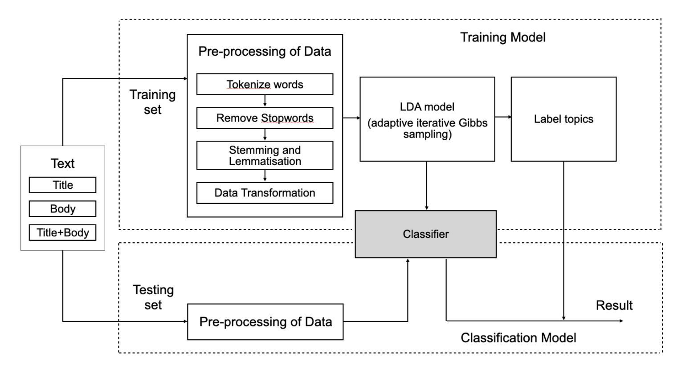

 Figure 3.1: The flowchart of the method using the LDA model as a classifier 

The news data was split into three datasets (title text, body text, and full text), and each dataset was further divided into an 80% training set and a 20% testing set. After the data preprocessing of the training set is performed, the model is trained. The categories of the training set are then examined in conjunction with the topics generated by the model, and the generated topics are labeled with category tags. The model is considered a classifier once the topics are labeled. To assess the classifier’s performance, predictions are made on the testing set using the model to determine the classification accuracy.

### 3.1 Data
The raw data includes 6,877 pieces of unique data on news articles published in HuffPost in 2021 (https://www.kaggle.com/datasets/timilsinabimal/newsarticlecategories), where the data records the category, title, and body (content) of the news article. The categories of this news are *Arts and Culture*, *Business*, *Comedy*, *Crime*, *Education*, *Entertainment*, *Environment*, *Media*, *Politics*, *Religion*, *Science*, *Sport*, *Tech* and *Women*.

News titles accurately summarise the subject which contains fewer words to convey the essence of the news. News content conveys comprehensive information about an event and provides a detailed description of the news headlines. To assess the influence of text size on classifiers, the dataset is divided into title text, body text, and overall text, with average word counts of 10.17, 626.33, and 636.5 respectively. The entire dataset is divided into training and testing sets using simple random sampling, with a distribution of 80% and 20% respectively.

### 3.2 Model Construction
#### 3.2.1 Pre-processing of Data
The raw database was pre-processed to make it better for use and analysis. The pre-processing scheme was as follows:

1. Tokenize words and Clean up text
   
   As mentioned in Section 2.2, the LDA topic model assumed that the text was composed of discrete words. Therefore, tokenization involves splitting the text into individual words or vocabulary items, known as tokens. Generally, it is divided by spaces, punctuation marks, etc. The result of tokenization is often referred to as a "bag of words" representation. The text was split into sentences, and the sentences were further divided into words, with punctuations and unnecessary characters have been removed in this article.

2. Remove Stopwords

   Stopwords appear frequently in the text but do not often have real meaning. Examples of stopwords include words such as ’I’, ’me’, ’my’, ’myself’, etc. Removing stopwords could reduce the text noise and improve the accuracy of text analysis.

3. Stemming and Lemmatisation

   In text, different word forms such as verb tenses and noun plural forms may have the same semantic meaning. In news articles, vocabulary has diversity and complexity. Therefore, various word variants can be reduced to a base form (e.g., reducing ’seen’ and ’saw’ to ‘see’) through stemming and lemmatization, which makes the text more consistent.

4. Data Transformation

   It includes constructing a corpus and a dictionary, to convert the raw textual data into a format suitable for model processing. The corpus can convert text data into a structured document-term matrix, where each document is represented as a frequency vector of words. The dictionary can map each word to a unique numerical ID, thereby transforming the textual data into numerical vectors. For example, (0, 3) (2, 7) can be interpreted as a word with ID 0 appearing 3 times in the document, and a word with ID 2 appears 7 times.

#### 3.2.2 Model Specification
The LDA model was used as a probabilistic generative model for topic modeling, which was used to discover hidden topic structures in the text. The model is used as a classifier in this paper to assess the performance of the model through the classification accuracy of the test set to explore whether different variables (title, body) were suitable for the model. Therefore, the number of topics in the model parameters is set to 14 (consistent with the number of news categories), α and β equal to 1 which are hyper-parameters that affect the sparsity of the topics (the default values are used in the base model). The chunksize parameter is used to specify the size of document batches processed at a time during the training of an LDA model, which is set as 256. passes=10 (default value). Ensuring the consistency of the parameters also facilitates the comparison of the performance of the two models.

#### 3.2.3 Label Topics
To assess the classifier’s capability, it is necessary to evaluate the model with a testing set. The criteria for evaluating the classifier’s performance involve whether the document is classified correctly. Before this, it is necessary to label the "topics" of the model to facilitate our understanding of these topics. As mentioned in 3.2.2, the number of topics of the model parameters is 14. It is possible to determine which generated topics are closed to specific news categories to effectively distinguish between different topics. Thus, the process of labeling topics involves "recognizing" the topics generated by the model and establishing a one-to-one correspondence between each topic and the 14 categories.

The correct labeling of the topic has a great impact on the performance verification of the model. For example, in the original data set, 80% of the sports news and 15% of the economic news in the model account for topic 1 generated by the model. If topic 1 is defined as the "Economics News" topic, a high probability of misclassifying sports news in the testing set might lead to a conclusion that a low classification accuracy from the classifier. Such a conclusion does not reflect the performance of the model, which is a mistake in labeling the model.

The correspondence between the generated topics and the known categories is not unique. Based on the nature of the LDA model, the topics generated by the model consist of a mixture of words from various categories. For instance, a generated topic might include high-frequency words related to both "economics" and “government”. Therefore, it becomes highly important to employ a scientific approach when labeling topics.

The following are the specific steps for labeling:
1. As shown in Figure 3.2, LDA assumes that each article is composed of multiple topics, and the "contribution" of each topic is different. Therefore, the topic with the highest contribution proportion is defined as the primary topic of that news article.

    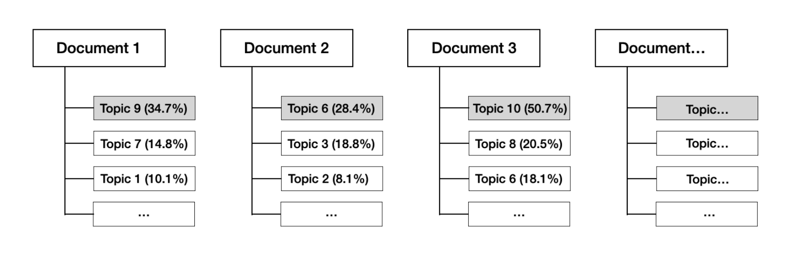

 Figure 3.2: Percentage of each topic in each document. Topic 9 accounts for 34.7% of article 1, and it is considered that this topic contributes the most to this article, so article 1 belongs to topic 9. Similarly, article 2 belongs to topic 6 (28.4%), and article 3 belongs to topic 1 (50.7%).

2. As shown in Figure 3.3, the top three topics in the proportion of documents in each category are listed separately, which is convenient for labeling the topics.

    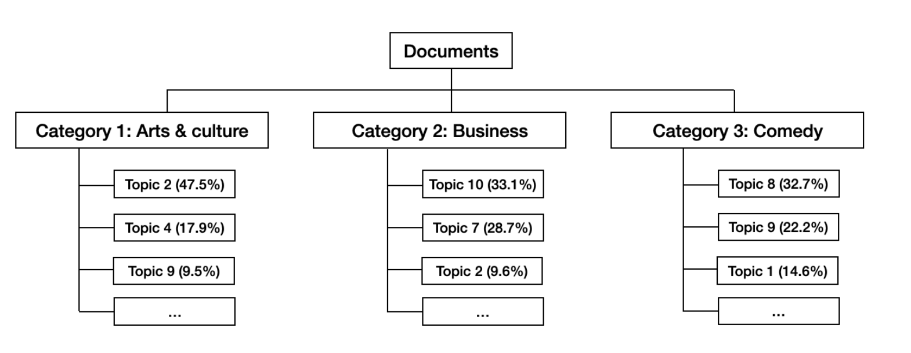

 Figure 3.3: Percentage of each topic in each category in the document.

3. The principle of topic labeling is as follows
 
   (a) If a topic holds a proportion of over 40% within a category, it signifies that in the training set, this topic carries substantial weight in documents belonging to that category, and is considered to be "closely associated" with that category. Hence, during the first allocation, this topic is labeled as belonging to that category. As shown in Figure 3.3, topic 2 is labeled as “Arts & culture because it has a proportion of 47.5% (over 40%) within that category. Each topic corresponds uniquely to a news category. If a topic simultaneously holds the highest proportion in two different news categories, both over 40%, the model designer should intervene with subjective judgment.

   (b) A second allocation is made to topics that account for less than 40% but still have a high proportion. As shown in Figure 3.3, within the "business" category, both topic 10 and topic 7 hold relatively high proportions and are relatively close in value. Consequently, topic 10 and topic 7 are more likely to be labeled “business”. In the second allocation, there may be situations where one topic corresponds to multiple categories, requiring model designers to intervene in subjective judgment and adjustment.

   (c) After the first two allocations, if the topic still has no labels, it should be manually labeled by the model designer after checking the high-frequency words in the topic.

### 3.3 Classification Analysis
#### 3.3.1 Topics Visualisation
To estimate the impact of different text sizes on the classification performance of the classifier, three datasets are used to create separate LDA models for the training sets. As mentioned in Section 3.2.3, each labeled topic corresponds to a unique category, implying that there was a certain level of "distinctiveness" among topics. Topics are visualized in a way that allows for a better understanding- ing and interpretation of individual topics, as well as the relationships between them. If a model generates topics with a high degree of word overlap in their vocabulary, labeling these topics becomes challenging. In visualization, the occurrence of overlap among topics can lead to increased complexity in interpreting the model, and this complexity might be due to the data itself. Generally, we aspire for topics in LDA visualization to be more dispersed. This implies that each topic has more unique words, and the boundaries between topics are clearer and can be better distinguished.

#### 3.3.2 Prediction Accuracy
Predictive accuracy is an evaluation metric that reflects a model’s ability to correctly classify samples. By applying various models to the test dataset and calculating their predictive accuracy, the classification performance of each model can be quantified and compared. This approach not only aids in assessing model performance under different conditions but also provides evidence for model selection and optimization. Therefore, the comparison of predictive accuracies among different models offers more accurate and reliable conclusions for our research.

### 3.4 Augmented Model Optimisation
The optimization of the LDA model aims to improve its adaptability for a more accurate interpretation of text data and effective topic analysis. By adjusting parameters, the model can be optimized to improve the accuracy of topic modeling and enhance text classification performance.

#### 3.4.1 Goodness of Fit Testing: Coherence Score
To aid users in understanding trends and developments in specific domains, researchers have proposed the method of topic coherence to assess the quality and interpretability of topic models (Aletras and Stevenson, 2013). It is used to measure the semantic relevance of words in a topic, specifically measuring the semantic similarity between the first few high-frequency words within the topic. A topic is considered to possess a high coherence score when the vocabulary contained within the topic exhibits close relationships, determined by calculating the mean or median of pairwise word-similarity scores among the words comprising the topic.

One of the most popular coherence metrics is called Cv, which was found by Röder et al. in 2015 to have high interpretability and is widely used to evaluate topic models. It is also the default setting in Gensim-CoherenceModel in Python. It gets the coherence score by calculating the average of all cosine similarities between each topic word and its topic vector. The topic model is trained by K topics and the most probable words N per topic.

#### 3.4.2 Number of Topics (K)
A low number of topics results in either too few or overly broad topics, while a high number of topics leads to topics that are difficult to interpret. Therefore, selecting the appropriate value for K (the number of topics) is an important task in LDA. As mentioned in Section 3.4.1, a higher coherence score indicates better model interpretability and it increases with an increase in the number of topics. Therefore, choosing the model with the highest coherence score before it levels off or sharply decreases is meaningful when determining the number of topics. For this model, the parameters $\alpha$ and $\beta$ are set to their default values. In the Python Gensim package, the default parameter for alpha is set to ’symmetric,’ which means that each document has the same alpha value. During the modeling process, the default parameter for beta is ’None’ which means Gensim automatically estimates beta based on the document data.

#### 3.4.3 Dirichlet Hyperparameter ($\alpha$ and $\beta$)

Grid search is a method of hyperparameter optimization that can automatically find the best combination of hyperparameters. Based on Section 3.4.2, we select the value of k that achieves the highest coherence score as the number of topics and proceed to determine the best combinations of $\alpha$ and $\beta$. In the same way as determining the optimal number of topics, we select the best combination of model parameters using the Coherence score as a criterion.

## 4. Results
### 4.1 Overall Result of Classifier
#### 4.1.1 Topic Labelling Analysis
In the LDA model generated using title text as the training set (Table 4.1), the topic proportions within each category are similar. For instance, Topic 7 appears as the highest contributing topic in all news categories six times, and as the second-highest contributing topic five times. Therefore, it’s challenging to determine the "characteristics" of this topic for labeling. Similarly, combined with the analysis of salient terms for each topic (Table 4.4), it is not possible to assign unique labels to different topics based solely on the high-frequency words within each topic. Based on Section 3.2.3, this model is unable to assess classification performance as a classifier.

Table 4.2 and Table 4.3 display the topic contribution rates of each category in the LDA models generated using body text and full text as the training set. There is a clear distinction in the contribution rates of topics across different categories. Therefore, the labeling principles used in Section 3.2.3 are applicable. Table 4.4 and Table 4.5 present the salient terms for each topic in the two models and the results of labels for each topic.

    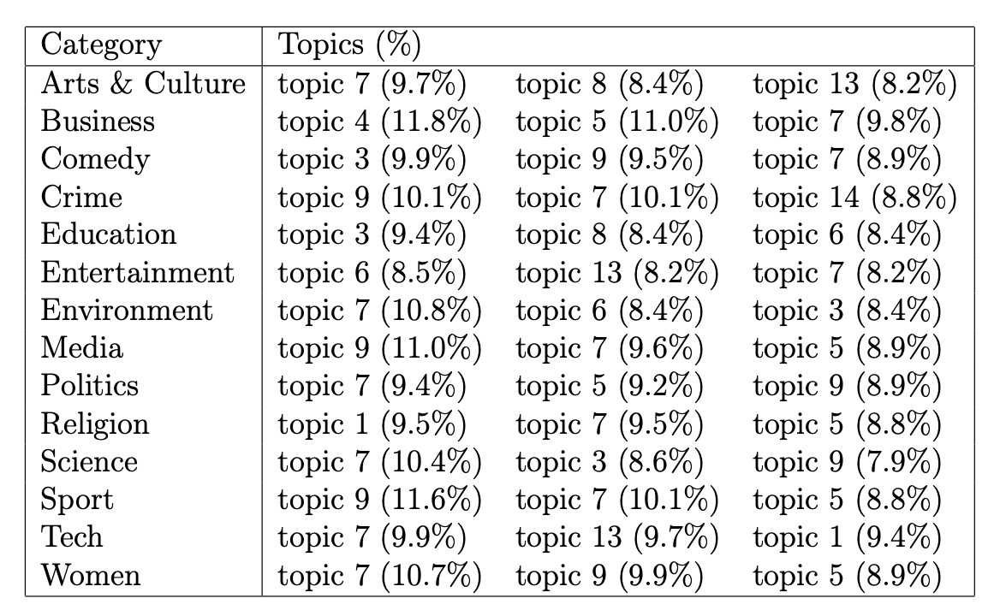

 Table 4.1: Percentage of topic contribution in each category (title text). The highest contribution topic proportions for each news category do not exceed 12%. The average proportion of the top-contributing topic is 10.19%, the second-contributing topic is 9.32%, and the third-contributing topic is 8.73%, which shows that in each category, the distinguishability of topic contribution rates is not obvious.

    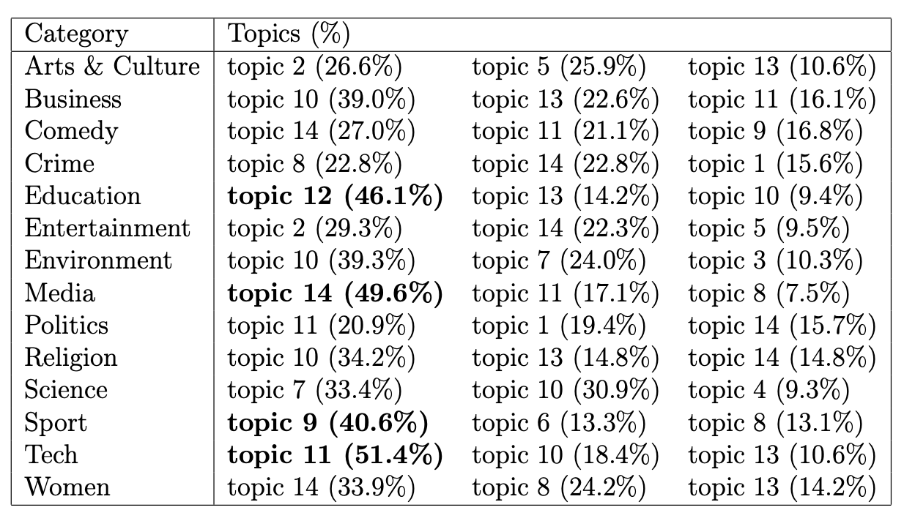

 Table 4.2: The proportion of the highest topic contribution in 4 categories exceeds 40%, allowing for direct labeling (principle (a) in Section 3.2.3). The highest topic contribution rate in 9 categories exceeds 30%. The average of the highest- contributing topic proportions (the first column) is 35.3%. Different topics have obvious "bias" for different categories.

    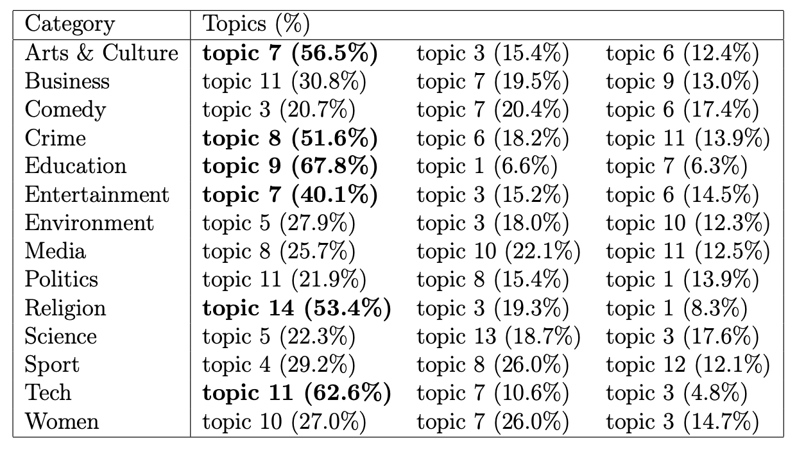

 Table 4.3: Percentage of topics in each category (full text). In 6 categories, the highest-contributing topic proportions were over 40%, allowing for direct labeling. Please note that Topic 6 appears in 2 different categories, and labeling should be based on subjective judgment (principle (a) in Section 3.2.3). The highest topic contribution rates in 11 categories exceed 25%. The average of the highest-contributing topic proportions is 38.4%.

    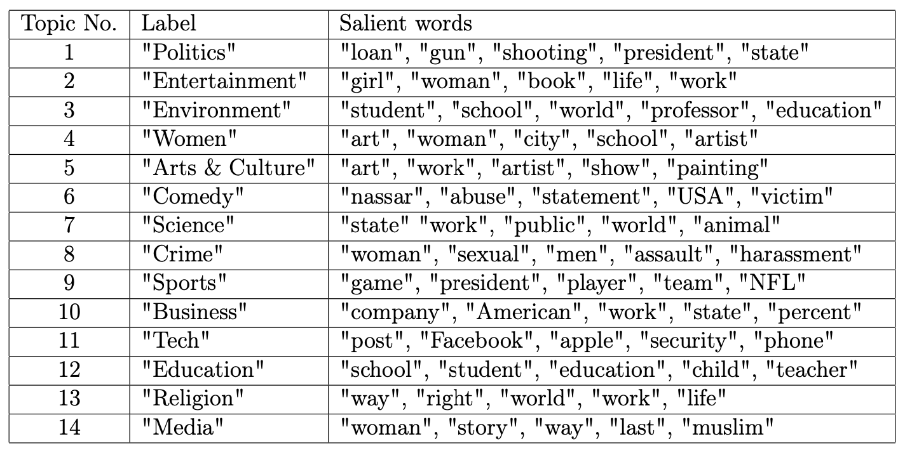

 Table 4.4: Topic label (body text) & Top 5 Salient words for each topic.

    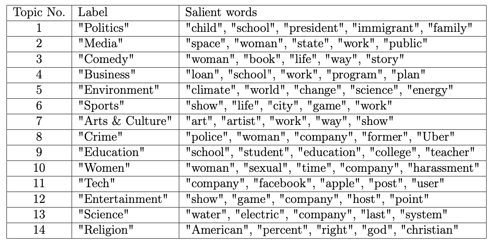

 Table 4.5: Topic label (full text) & Top 5 Salient words for each topic

#### 4.1.2 Model Comparison

It shows that the boundaries between topics are not clearly defined from the model trained by the body text, and there are varying degrees of overlap between topics (Figure 4.1: Left). It suggests that these topics are not fully distinguishable from each other, potentially affecting the interpretability of the model and the clarity of the topics. The model trained by the full text exhibits less overlap and relatively larger distances between topics (Figure 4.1: Right).

    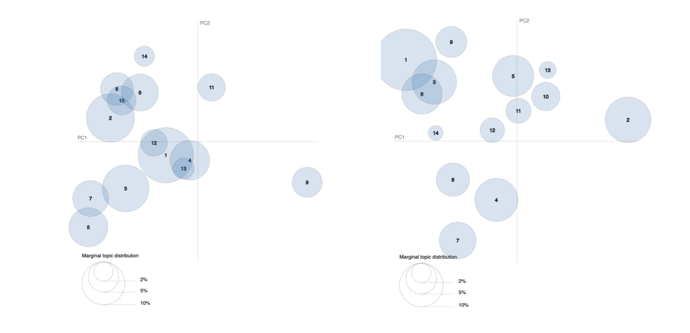

 Figure 4.1: Comparison of the topic distribution visualizations of two models (Left: body text; Right: full text). The visualization on the left shows that topics 2, 6, 8, and 10 overlap with each other, and topics 12 and 13 highly overlap with topic 1. On the right-hand side, there is overlap only among topics 1, 3, and 6.

In Table 4.6. The model trained by the body text achieves a classification accuracy of 31.5% on the testing set, while the accuracy of the classification from the model trained by the full text is 39.2%. It can be considered that the classification performance of the latter as a classifier is better than that of the former.

    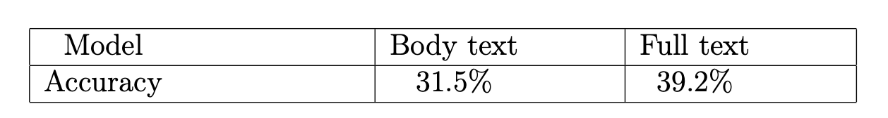

 Table 4.6: The classification accuracy of the prediction from the testing set.

### 4.2 Hyperparameter Tuning
In this section, The model trained by body text is labeled as "Model A" and the model trained by full text is labeled as "Model B”. The optimization effect of the model is evaluated based on the coherence score (mentioned in Section 3.4.1). Before adjusting the parameters, record the initial coherence scores of the two models (Table 4.7).

    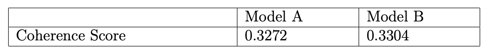

 Table 4.7: Coherence score for K=14 (same as number of news categories) in model A and model B. The coherence score of model B is greater than that of model A, which means that the topics of model B are more interpretable and understandable when K=14. 

#### 4.2.1 Number of Topics (K)
With parameters α and β set to default values, Model A and Model B achieve maximum coherence scores at 9 and 11 topics, respectively (Figure 4.2 and 4.3). Therefore, these values are chosen as the optimal number of topics for the models.

    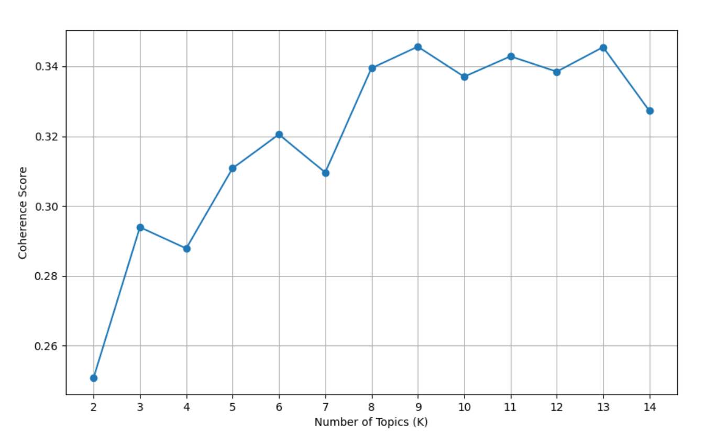

 Figure 4.2: Coherence score for Model A with different numbers of topics, The coherence score reaches its maximum value of 0.3456 at K=9, which is a 5.6% improvement compared to the initial value at K=14.

    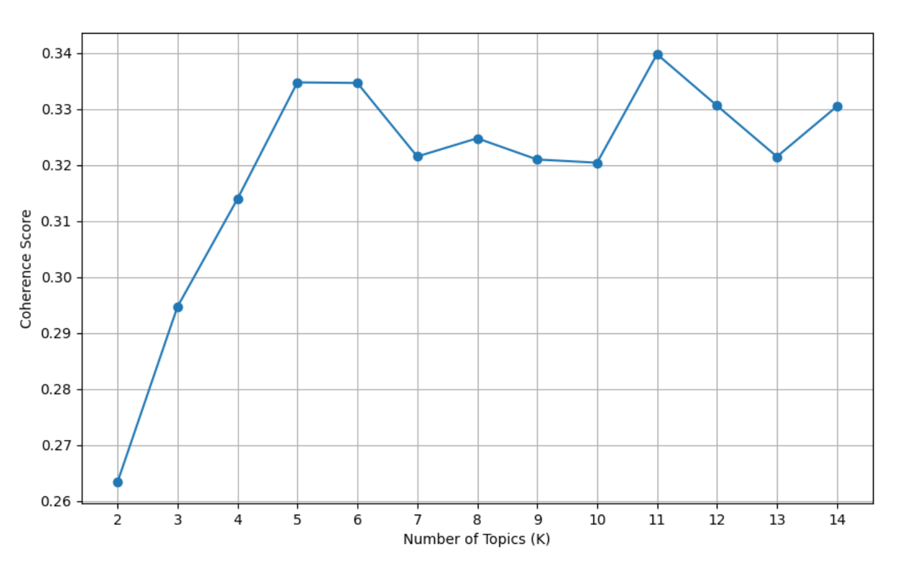

 Figure 4.3: Coherence score for Model B with different numbers of topics, The coherence score reaches its maximum value of 0.3397 at K=11, which is a 2.8% improvement compared to the initial value at K=14. 

