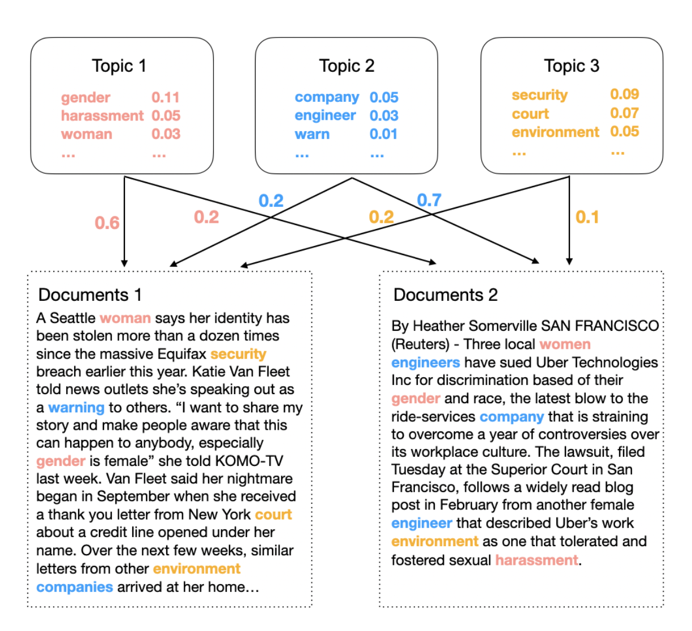
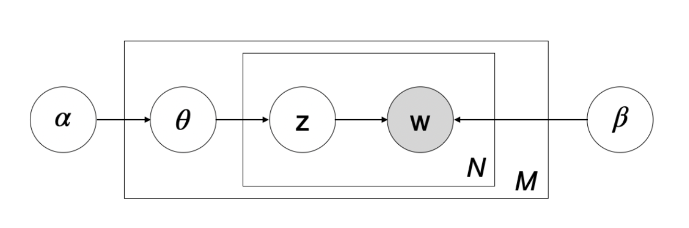

# Probability Topic Model: Model Comparison for Different Text Sizes 

This project aimed to introduce, explain, and use probabilistic topic models, a class of statistical models for text data analysis designed to identify and extract latent topic structures from text data. This article focused on the **LDA (Latent Dirichlet Allocation) model** in the probabilistic topic model, which is based on Bayesian statistical inference methods and uses the Dirichlet distribution to model the relationship between topics and documents. The main objective of the LDA model is to extract topics from textual data to enhance our comprehension of the content and to facilitate tasks like text classification.

The LDA model in the project was tested on three news dataset sizes: **title text, body text, and full content** to investigate the impact of text data size. The evaluation criteria for model quality were **classification efficiency** and **coherence score**.

All corresponding codes can be found in the [lda.py](https://github.com/atomxu10/NLP-ProbabilityTopicModel/blob/main/lda.py)

## Content
- [1. Introduction & Overview](#1)
- [2. Latent Dirichlet Allocation (LDA) Theory](#2)
  - [2.1 Bayesian Inference](#2-1)
  - [2.2 The Generative Process of LDA Model](#2-2)
  - [2.3 Parameters Fitting](#2-3)
  - [2.4 Assumption, Notation, and Algorithm](#2-4)
  - [2.5 Gibbs Sampling](#2-5)
- [3. Method](#3)
  - [3.1 Data](#3-1)
  - [3.2 Model Construction](#3-2)
    - [3.2.1 Pre-processing of Data](#3-2-1)
    - [3.2.2 Model Specification](#3-2-2)
    - [3.2.3 Label Topics](#3-2-3)
  - [3.3 Classification Analysis](#3-3)
    - [3.3.1 Topics Visualisation](#3-3-1)
    - [3.3.2 Prediction Accuracy](#3-3-2) 

## 1. Introduction & Overview

With the development of the internet, information is provided to people in various forms, such as texts, images, audio, and videos. However, as the information continues to grow, the necessity of developing an efficient tool to process, comprehend, and analyze this information becomes essential. Consequently, in the field of text information retrieval, extensive research is conducted in areas including text summarisation, text extraction, and dimensionality reduction. Researchers believe that if a substantial amount of textual data is converted into some low-dimensional subspaces through some tools, information covering this type of text data can be harvested, and then it can be "zoomed in or out" to access and explore the information we desire. Among them, the probabilistic topic model is one of the models with rapid development and mature application.

The probabilistic topic model is an unsupervised analytical tool to uncover hidden thematic structures from text and to establish probabilistic relationships between texts and topics. The LDA topic model is one of the most common and widely applied probabilistic topic models. It is characterized by its Bayesian foundation, which aids in revealing the distribution of topics in textual data, the relationships between topics, and the connections between topics and vocabulary. Practical applications of probabilistic topic models included text classification, information retrieval, content analysis, and content modeling, among other fields. By unearthing the underlying themes within textual data, the model could offer a deeper comprehension and analysis of textual content.

This project attempted to investigate the use of the LDA model and evaluate its quality. Particularly, it intends to answer three questions:

**Q1: Does the size of the text have an impact on the recognition and classification of the model when using the LDA topic model as a classifier?**

**Q2: How can hyper-parameters be utilized to improve model efficiency?**

**Q3: How does the size of the text data affect the interpretability of the LDA model?**

In **Chapter 2**, the principles and different parameters of the model will be introduced. Gibbs sampling, which is an inference method applied to the LDA model for processing and operating on text data, will also be introduced.

**Chapter 3** is divided into two main sections. The first section is dedicated to the exposition of the dataset and the process of constructing the model. Within this section, a comprehensive account of the data preprocessing procedures is provided. Detailed specifications of the model, as well as the methodology employed by labeling the topics to the model in preparation for subsequent categorization analysis are elucidated. The second section contains an introduction to the enhancement of model performance, as well as a description of the methods and criteria employed for evaluating model performance.

In **Chapter 4**, the results are obtained, and the impact of varying text sizes on the classification of the LDA topic model is discussed. Additionally, an analysis of model performance enhancement through hyper-parameter optimization is conducted.

In **Chapter 5**, the results of this analysis are discussed, and some directions for further study are provided.

## Latent Dirichlet Allocation (LDA) Theory

### Bayesian Inference
Bayesian inference is a method for calculating the probability of an event based on prior knowledge (prior beliefs or assumptions) and new evidence (outcomes of related events). It allows us to use new observational results to improve the model by iteratively updating the prior probability with more observational evidence, generating new posterior probabilities.

The form of Bayes theorem:

$$\pi(\theta \mid \mathbf{x}) = \frac{\pi(\theta) f(\mathbf{x} \mid \theta)}{f(\mathbf{x})}$$

- Prior
  
  $\pi(\theta)$ is known as the prior distribution of $\theta$, which represents the initial understanding of an event and the assessment of its probability distribution before observing any new data. This prior information can be based on previous data, domain expertise, or subjective evaluation.

- Likelihood
  
  $f(\mathbf{x} \mid \theta)$ is known as the likelihood function. It describes how data is generated given certain parameters and quantifies the probability of observing data under different parameter values.

- Posterior

  $\pi(\theta \mid \mathbf{x})$ is known as the posterior distribution of $\theta$. It is calculated by combining prior information and likelihood. It represents the updated belief about an event after considering new evidence.

The proportionality constant $f(\mathbf{x})$ is also known as the evidence. It normalizes the posterior distribution so it integrates to 1. Therefore, the form of Bayes theorem also can be represented as:

$$\pi(\theta \mid \mathbf{x}) \propto \pi(\theta) f(\mathbf{x} \mid \theta)$$

The posterior is proportional to the product of the likelihood and the prior.

### The Generative Process of the LDA Model

The LDA model assumes that documents are composed of multiple topics, each topic consisting of a set of words. Each document is probabilistically assigned different topics, and each topic is probabilistically associated with different words. These topics are hidden in the model and cannot be directly observed. However, by introducing the Bayesian theorem, we can attempt to infer the possible topics in a document and their distributions by observing the words within the document. LDA model uses the Dirichlet distribution to model the distribution of topics and words. The Dirichlet distribution is a probability distribution that describes the distribution of a multinomial distribution. This hierarchical structure where documents are made up of topics, and topics are made up of words allows LDA to capture complex relationships between documents, topics, and words.

Specifically, before generating a new document, the document’s topic distribution needs to be determined, which defines the weight of each topic in the new document. The LDA model uses the Dirichlet distribution as a prior distribution for the topic distribution. The hyperparameter α controls the diversity and sparsity of the topic distribution. Once the topic distribution is determined, sampling can be done randomly from a pre-defined distribution or calculated based on prior information. After selecting a topic, specific words can be generated according to the word distribution of the selected topic. The word distribution is considered a multinomial distribution, and the process of selecting words is equivalent to sampling from a multinomial distribution. The number of times a word occurs in a document depends on how likely that word is to occur in a given topic.

    

Figure 2.1: The Generative process of LDA model 

For Document 1, the distribution of topics is characterized by 60% for Topic 1, 20% for Topic 2, and 20% for Topic 3. Similarly, for Document 2, the distribution of topics is 20% for Topic 1, 70% for Topic 2, and 10% for Topic 3. Within each topic, words follow a multinomial distribution, representing the probability distribution of words within the topic. In Topic 1, the probability of sampling "gender" is 11%, "harassment" is 5%, and "woman" is 3%.

### Parameters Fitting
The parameters set by the user affect the learning process of the model and the final result. These parameters are not obtained through data training but are determined by some prior knowledge or experience. The value of the parameter usually needs to be adjusted and optimized according to the actual situation. The values of these parameters can impact the performance of the LDA model and the generated topic distributions. The following are some of the main parameters in the LDA model:

- Number of Topics (K)
  
  It defines the number of topics the user aims to extract from the data. Too few topics may lead to information loss, while too many topics could render the model difficult to interpret. Hence, choosing an appropriate number of topics is pivotal in determining the model’s quality.

- Parameter $\alpha$
  
  Parameter $\alpha$ is the Dirchlet-prior concentration parameter of the per-document topic distribution, determining the density of the topic distribution for each document. A smaller value of $\alpha$ leads to sparser topic distributions within documents, implying that each document tends to be associated with only a few topics. Conversely, a larger value of α results in more uniform topic distributions within documents, meaning that each document might encompass a broader range of topics. The appropriate value of $\alpha$ depends on the characteristics of the text data, usually between 0.01 and 1.

- Parameter $\beta$

  The parameter of the per-topic word distribution determines the density of the vocabulary distribution of each topic. A smaller value of $\beta$ results in sparser vocabulary distributions for topics, implying that each topic is likely to consist of a small number of words. A larger value of $\beta$ makes the vocabulary distribution of the topics more even. Similar to $\alpha$, the appropriate value of $\beta$ depends on the characteristics of the text, usually between 0.01 and 1.

- Number of Iterations

  LDA models are often trained using iterative algorithms like Gibbs sampling. Iterations refer to the number of times the algorithm performs sampling and updates parameters. A higher number of iterations means that the model requires more sampling and parameter updates, resulting in increased training time. A high number of iterations may lead to overfitting, while too few may cause the model to fail to adequately learn the topic structure. The suitable iteration counts to aid in the model converging to a stable state.

### Assumption, Notation, and Algorithm
- N represents the total number of collection words in a document. A document is represented as $\mathbf{w}$ = { $\{w_1, w_2, \ldots, w_N\}$ }, where $w_n\$ is the nth word in sequence.

- A corpus is represented as $\mathbf{D}$ = { $\{\mathbf{w}_1, \mathbf{w}_2, \ldots, \mathbf{w}_M\}\$ }, $M\$ is the number of documents.

The LDA model assumes that the document is generated in the following way:

1. Determine the number of topics K required, and determine the document length N
2. Obtain the parameter θ from the Dirichlet distribution of the hyper-parameter $\alpha$.
3. For each word token $w_n\$ in the document
   
     (a) Sampling topic z from a multinomial distribution with $\theta$ as a parameter, $z_n \sim \text{Multinomial}(\theta)\$.

     (b) The word distribution is determined by sampling, which is jointly determined by topic z and hyperparameter $\beta$.

Given parameters $\alpha$ and $\beta$, the joint distribution of $\theta$, z, and w is given by:

$$p(\theta, z, w \mid \alpha, \beta) = p(\theta \mid \alpha) \prod_{n=1}^{N} p(z_n \mid \theta) p(w_n \mid z_n, \beta)$$

$p(\theta \mid \alpha)$ determines how likely it is to observe the topic distribution of $\theta$ conditional on $\alpha$, $p(z_n \mid \theta)$ is the probability of the individual topic assignment $z_n$ of word $n$ is conditional on the topic distribution of $\theta$. $p(w_n \mid z_n, \beta)$ is the probability of each word conditional on the topic assignment $z_n$ and the word probabilities of the given topics which are determined by $\beta$.

The likelihood of the document can be represented as:

$$\prod_{d=1}^{D} P(\theta_d \mid \alpha) \left( \prod_{n=1}^{N_d} \sum_{z_{d,n}} P(z_{d,n} \mid \theta_d) P(w_{d,n} \mid z_{d,n}, \varphi) \right)$$

The objective of the likelihood function is to maximize the probability that the model generates the observed data so that the model can better explain the observed text data. Due to its computational infeasibility, methods such as Gibbs sampling and variational inference are usually used in practical applications to maximize the likelihood function to estimate the parameters and hidden variables of the model.

    

Figure 2.2: Plate representation of LDA generative document process (inspired by Blei’s diagram (Blei et al., 2003)). Each variable is denoted by nodes, and arrows mark the generation process of nodes. The proportion parameter($\alpha$), topic proportions($\theta$), assignments(w), and topics($\beta$) are not shaded. The observed word (w) is shaded. The rectangles are “plate” notation, which represents replication. The N plate represents the collection words within documents; the M plate denotes the total number of documents within the collection.

